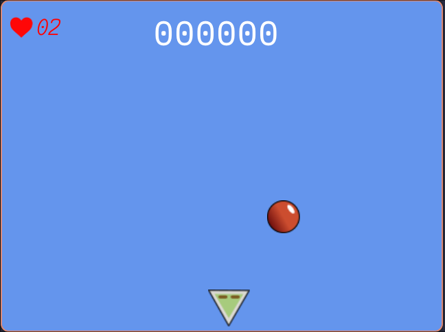

# Superfighter

A simple 2D game built with Go and the Ebitengine game library.

## Description

In Superfighter, you control a robot and must catch falling bombs to score points. If you miss a bomb, you lose a life. The game resets when you run out of lives.

## Installation

1.  **Clone the repository:**
    ```bash
    git clone https://github.com/IstoMan/RoboFeast.git
    ```
2.  **Navigate to the project directory:**
    ```bash
    cd superfighter
    ```
3.  **Install dependencies:**
    ```bash
    go mod tidy
    ```

## Usage

Run the following command to start the game:

```bash
go run main.go
```

## Screenshots



## Dependencies

- [Ebitengine](https://ebitengine.org/)
- [golang.org/x/image](https://pkg.go.dev/golang.org/x/image)
